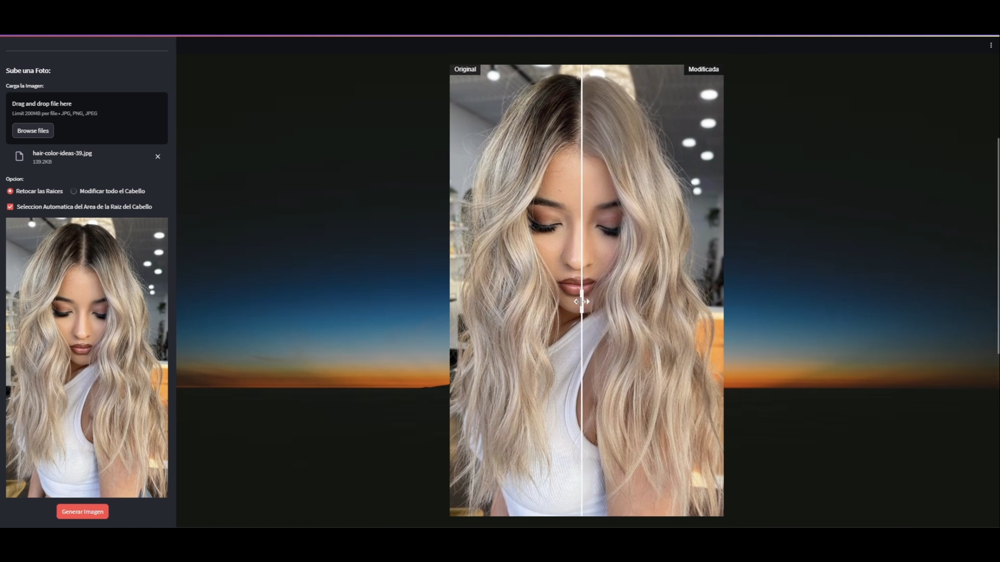

# Hair-Touch-Up-App-with-Stable-Diffusion-ControlNet-and-Streamlit

## Touch-Up the Hair Roots and Changing the Hair Color of an Image using Stable Diffusion, ControlNet, Mediapipe, KMeans, Streamlit and Flask.

This Generative AI App, using the Realistic Vision Stable Diffusion with ControlNet, KMeans and Mediapipe, can succesfully Touch-Up the Hair Roots of an Image based on the Dominant Hair Color of the Picture.

The Application can also change the Hair Color of the person, to the color that the user wants. The Fronted was built with Streamlit and the Backend with Flask.

## Preview

- App Preview: https://youtu.be/80StsWrfD8w?si=uHnDnmxjnNHUEArP

## Connect
- Linkedin: https://www.linkedin.com/in/luis-jose-mendez/
- GitHub: https://github.com/mendez-luisjose

---
title: Touch Up Hair
emoji: 📚
colorFrom: blue
colorTo: purple
sdk: streamlit
sdk_version: 1.33.0
app_file: app.py
pinned: false
---
